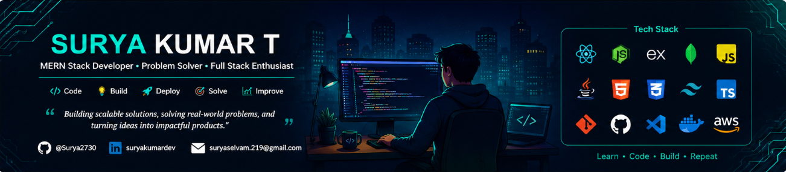

  

   

  

  

  

  

---

## 👋 Introduction

I'm **Surya Kumar T**, a Software Developer passionate about frontend development and full-stack web technologies. I specialize in building scalable, responsive, and production-ready web applications using the MERN stack. With a strong foundation in Java, Data Structures & Algorithms, and core computer science concepts, I enjoy solving complex problems, exploring modern technologies, and transforming innovative ideas into practical, real-world applications.

--- 

## 🚀 About Me

- 🎓 B.Tech Computer Science and Business Systems @ Bannari Amman Institute of Technology
- 💻 MERN Stack Developer passionate about building scalable web applications
- ☕ Strong foundation in Java, OOP, DBMS, OS and Computer Networks
- 🧩 Solved **300+ LeetCode** problems with a focus on problem-solving
- 🏆 Ideathon 2025 Thematic Award Winner
- 🌱 Currently learning **Spring Boot, Microservices, AWS & System Design**
- 🚀 Looking for **Software Development Engineer (SDE)** opportunities

 

---

## 💻 Tech Stack & Tools

| Category | Technologies |
|----------|--------------|
| 🌐 **Full Stack** |  React • Node.js • Express.js • Vite • REST APIs |
| ☕ **Java** |  Core Java • OOP • Spring Boot *(Learning)* • Maven |
| 🗄️ **Databases** |  MongoDB • MySQL |
| ☁️ **Cloud & Deployment** |  AWS *(Learning)* • Docker *(Learning)* • Vercel • Render |
| 👨‍💻 **Languages** |  Java • JavaScript • Python • C • C++ |
| 🛠️ **Tools & IDEs** |  Git • GitHub • VS Code • IntelliJ IDEA • Postman |
| 📚 **Currently Learning** |  Spring Boot • Microservices • AWS • Docker • System Design |

---

## 🚀 Featured Projects

### 🎓 [KnowMyCampus – Smart College Portal](https://github.com/Surya2730/KnowMyCampus)

> **Tech Stack:** MongoDB • Express • React • Node

- 🔐 Email & Google Authentication
- 📅 Event Management System with Admin CRUD
- 💬 Discussion Forum for Students
- 🏢 Company Eligibility Checker
- 👥 Role-Based Access Control
- 📱 Fully Responsive UI

**🔗 Repository:** *https://github.com/Surya2730/KnowMyCampus*

---

### 🛰️ [AI-Enabled Smart Infrastructure Audit & Inspection System](https://github.com/Surya2730/AuditManagement)

> **Tech Stack:** MERN • JWT • GeoLocation • Cloudinary

- 📍 Live GPS Verification
- 📸 Geo-tagged Audit Reports
- 📝 Digital Audit Workflow
- 📊 Admin Dashboard & Analytics
- 🔒 Secure Authentication

**🔗 Repository:** *https://github.com/Surya2730/AuditManagement*

---

### 🤖 [Student Dropout Prediction System](https://github.com/Surya2730/Dropout_Prediction_System)

> **Tech Stack:** MERN • Python • Scikit-learn • Flask

- 🎯 ML model with **84% Accuracy**
- 📈 Student Risk Prediction
- 🔐 Secure Authentication
- 🌐 MERN Frontend Integration

**🔗 Repository:** *https://github.com/Surya2730/DropOut_Prediction_System*

---

## 📈 Contribution Graph

  

---

## 🧠 LeetCode Stats

  

---

## 🌐 Connect With Me

  

  

  

  

